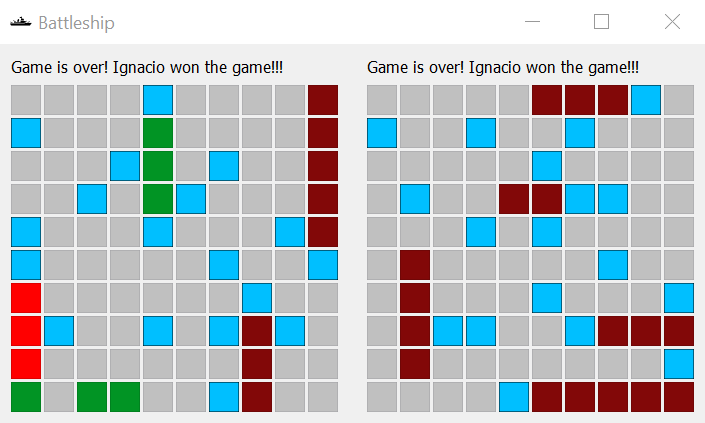
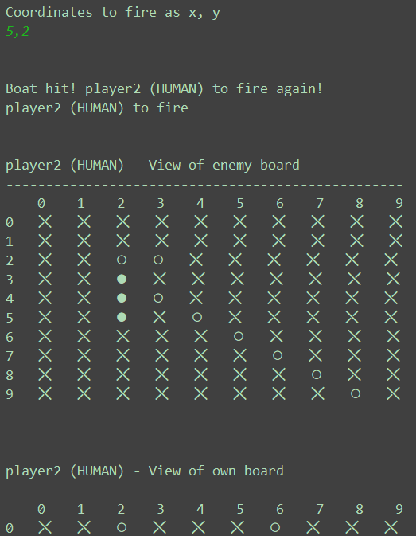

# Battleship

Own implementation of the game of battleship. Features a dedicated GUI and hooks for 
AI development.

## Dependencies

All dependencies are captured in the conda env `environment.yml`, with the main 
non-standard dependency being pyqt.

## Files
* battleship_ui.py: game of battleship, on a GUI 
* battleship.py: game of battleship, on CLI
* battleship_ai.py: definition of AIs playing the game

## Screenshots
Playing on GUI

Game over while playing on GUI

Playing on CLI

